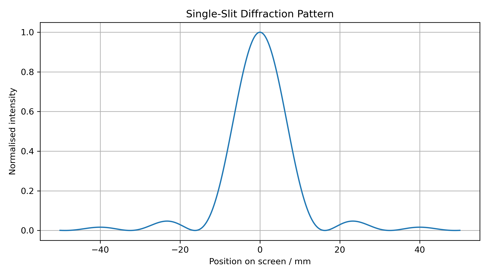
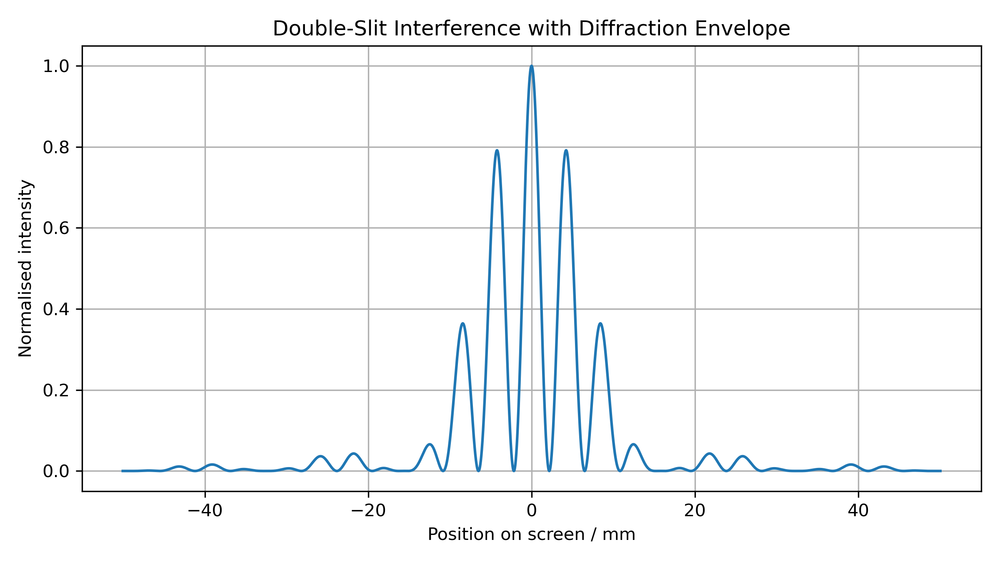
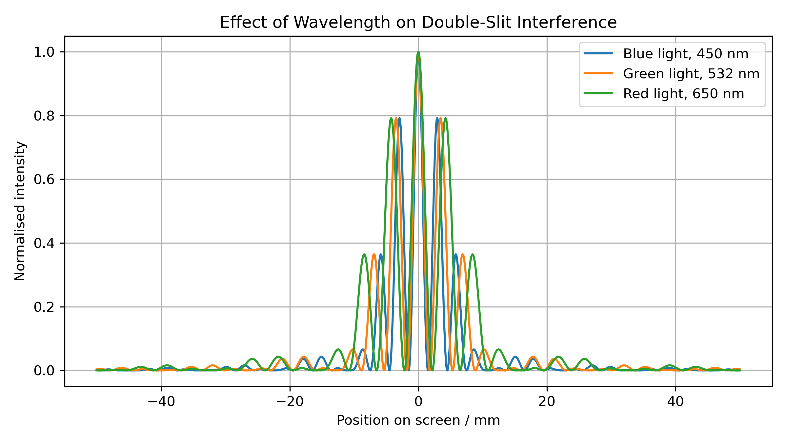
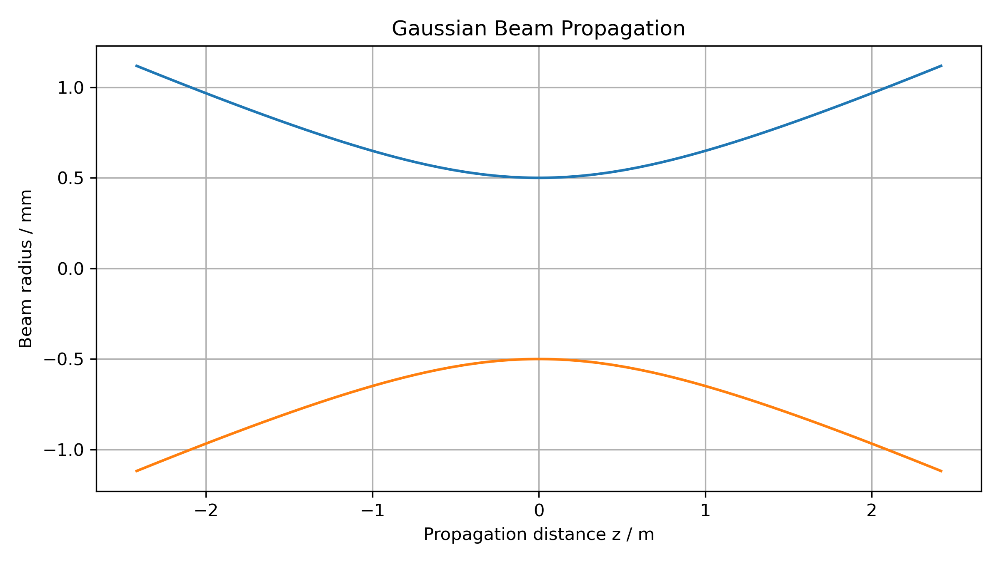
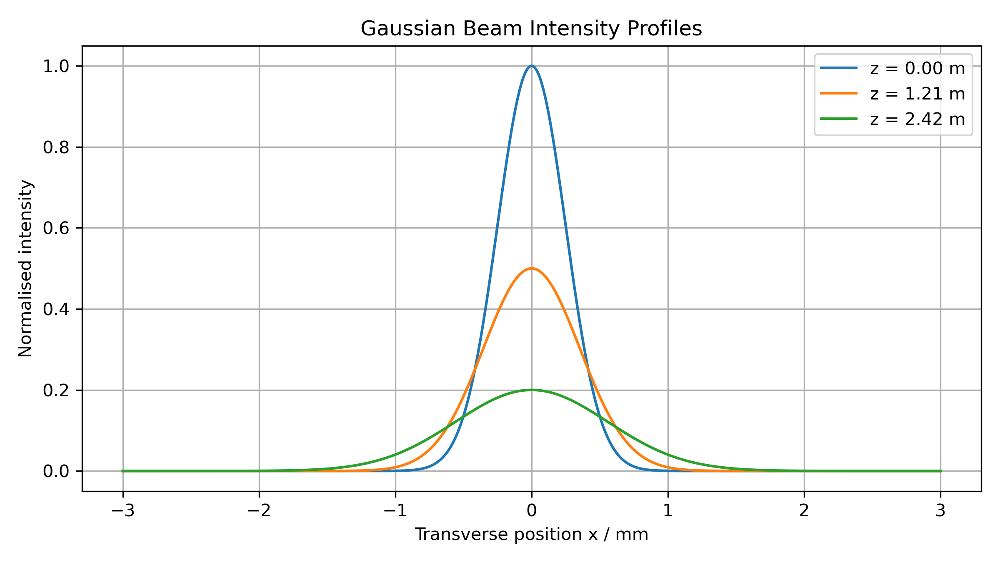

# Optical Wave Simulations

Python simulations of diffraction, interference and Gaussian beam propagation.

---

## Overview

This project contains Python simulations of several fundamental optical wave phenomena, including Fraunhofer single-slit diffraction, double-slit interference and Gaussian beam propagation.

I developed these simulations independently to build my understanding of wave optics while improving my Python programming, numerical modelling and scientific visualisation skills. The project combines analytical physics with computational methods to investigate how light behaves in a range of optical systems.

---

## Aim

The aim of this project was to investigate how light propagates through single and double slits, together with the propagation of Gaussian laser beams, using numerical simulation and visualisation. These phenomena are fundamental to optical physics and have applications in photonics, imaging systems, laser optics and wave-based sensing technologies.

---

## Features

* Fraunhofer single-slit diffraction simulation
* Double-slit interference with diffraction envelope
* Comparison of interference patterns for different wavelengths
* Gaussian beam propagation
* Gaussian beam intensity profiles at multiple propagation distances
* Clear, fully labelled visualisations generated using Matplotlib

---

## Technologies

* Python
* NumPy
* Matplotlib

---

## Physics

### Single-Slit Diffraction

The Fraunhofer diffraction pattern is modelled using

```text
                ⎛ sin(β) ⎞²
I(θ) = I₀       ⎜────────⎟
                ⎝   β    ⎠
```

where

```text
β = πa sin(θ) / λ
```

with

* **a** = slit width
* **λ** = wavelength
* **θ** = diffraction angle

---

### Double-Slit Interference

The double-slit intensity is calculated by combining the single-slit diffraction envelope with the interference term

```text
                ⎛ sin(β) ⎞²
I(θ) = I₀       ⎜────────⎟   cos²(α)
                ⎝   β    ⎠
```

where

```text
α = πd sin(θ) / λ
```

and

* **d** = slit separation

---

### Gaussian Beam Propagation

The beam radius evolves according to

```text
                 ___________________
                ╱          2
w(z) = w₀ √ 1 + │ z / zR │
               ╲___________________
```

where the Rayleigh range is

```text
zR = πw₀² / λ
```

The transverse intensity profile is modelled using the Gaussian beam equation, allowing the beam profile to be visualised as it propagates away from the beam waist.

The simulation shows how a laser beam spreads after its waist and how the transverse intensity profile becomes broader and lower with increasing propagation distance. This demonstrates how physical modelling and Python visualisation can be used to investigate optical beam behaviour.

---

## Methods

Python was used to

* define physical parameters including wavelength, slit width and slit separation
* calculate diffraction and interference intensity as a function of angle
* convert angular position into screen position
* generate and compare diffraction, interference and Gaussian beam plots
* investigate how changing physical parameters affects optical behaviour
* produce publication-quality visualisations using Matplotlib

---

## Example Results

### Single-Slit Diffraction



---

### Double-Slit Interference



---

### Effect of Wavelength on Double-Slit Interference



---

### Gaussian Beam Propagation



---

### Gaussian Beam Intensity Profiles



---

## Key Findings

* A narrower slit produces a broader diffraction pattern.
* Double slits produce closely spaced interference fringes within a wider single-slit diffraction envelope.
* Increasing the wavelength increases the spacing between interference fringes.
* Gaussian beams spread after the beam waist, causing the beam radius to increase and the peak intensity to decrease.
* The simulations demonstrate how analytical wave optics can be modelled computationally, with relevance to optical physics, photonics and laser-based systems.

---

## Running the Project

Install the required packages

```bash
pip install -r requirements.txt
```

Run the diffraction and interference simulations

```bash
python diffraction_simulation.py
```

Run the Gaussian beam simulations

```bash
python gaussian_beam.py
```

The generated figures are automatically saved in the `figures` directory.

---

## Possible Extensions

Potential future developments include

* Fresnel diffraction
* Airy disk diffraction from circular apertures
* Thin-film interference
* Interactive parameter controls
* Animated beam propagation
* Additional optical systems and wave phenomena

---

## Author

**Olivia Wooldridge**

Physics undergraduate at the University of Bath with interests in computational physics, numerical modelling, scientific programming and software engineering.
